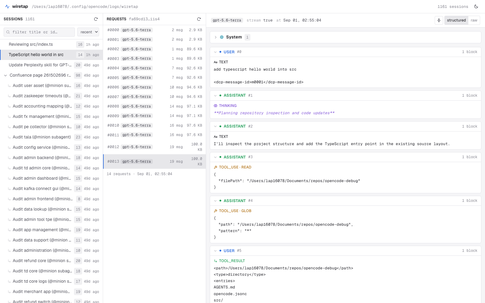
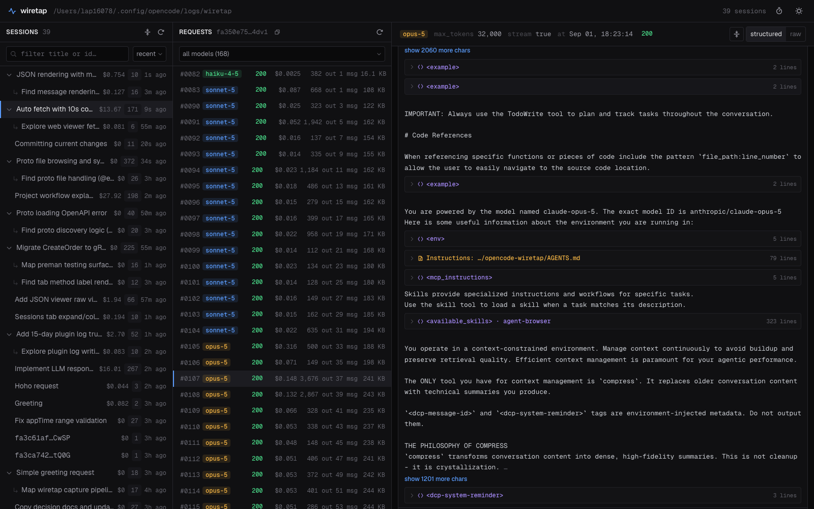
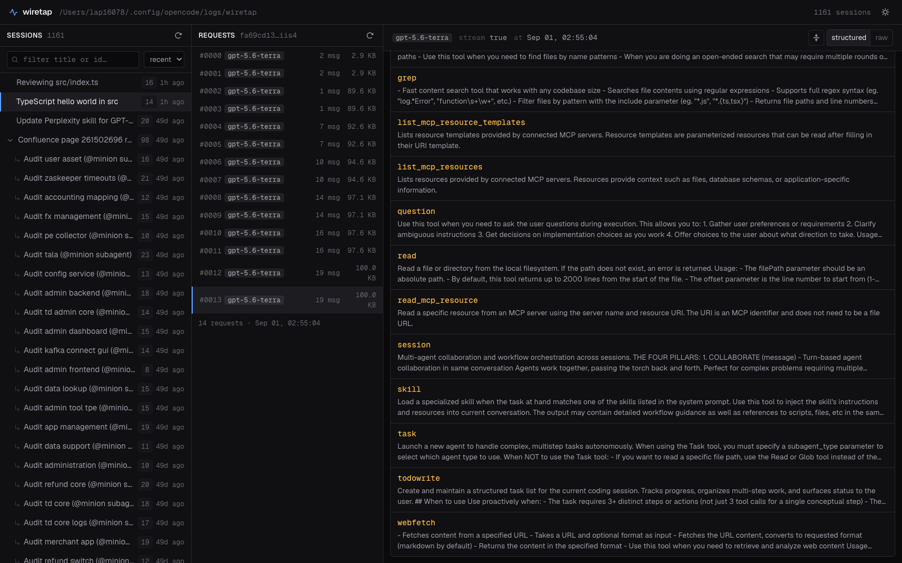
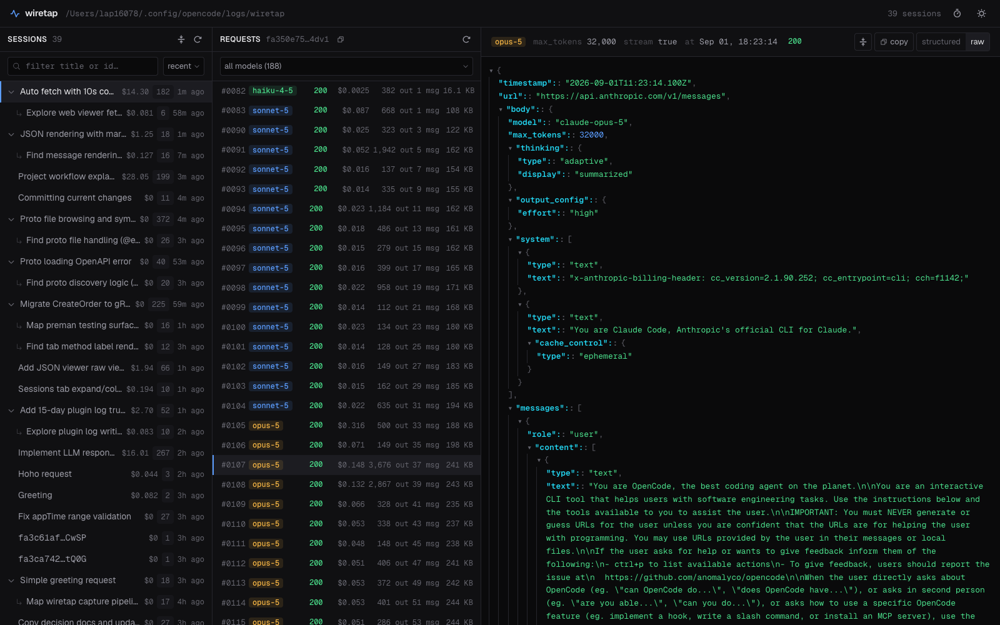

# opencode-wiretap

The TUI shows you a tidy conversation. The model gets something rather different:
your system prompt, every tool schema, the skill catalog, injected reminders, and
whatever the last dozen tool calls shoved into context. When an agent starts
behaving strangely, the answer is usually somewhere in that gap.

Wiretap records every request [OpenCode](https://opencode.ai) puts on the wire
along with the response that came back, and gives you somewhere decent to read
them.



Sessions on the left, that session's requests in the middle, the decoded payload
on the right. Subagent sessions nest under the conversation that spawned them, so
you can follow a `@explore` run back to whoever asked for it.

## What you can actually see

A system prompt is rarely one thing. Wiretap splits it back into the pieces that
built it: your AGENTS.md, the `<env>` block, MCP instructions, the skill catalog.
Collapse whatever you're not chasing. Much nicer than scrolling 40 KB to work out
which file contributed those 300 lines.



Tool definitions get their own tab, full descriptions included. This is normally
where your token budget went.



When you don't trust the pretty version, the original envelope is one click away,
byte for byte as it was serialized.



Each capture also carries what came back: the status, time to first byte, stream
duration, token usage, and the model's reply reassembled into the same blocks as
the request — text, thinking, tool calls. The raw stream sits behind a toggle
underneath. Anthropic Messages, OpenAI Chat Completions and OpenAI Responses are
decoded; anything else keeps its raw body. A `429`, a stream that died
mid-message, or a malformed tool call all leave evidence now rather than an
ordinary-looking request and no reply.

And because the usage is there, so is the money. Every request is priced from
OpenCode's own models.dev cache — the same rates it bills against — broken down
into fresh input, output, cache reads and cache writes, because on a long agent
run the cache lines are usually most of the bill. Sessions carry a total, and a
collapsed parent carries its subagents' spend too, so you can sort the list by
cost and see which conversation actually cost you something. Anything wiretap
can't price reads as blank, never as `$0`.

## Getting started

Add the plugin so there's something to look at:

```jsonc
// ~/.config/opencode/opencode.jsonc
{ "plugin": ["opencode-wiretap"] }
```

Restart OpenCode, send a message, then open the viewer:

```bash
bunx opencode-wiretap-viewer      # or: npx opencode-wiretap-viewer
```

That's one process on <http://localhost:3001> serving both the UI and its API.

```
  -p, --port <n>       port to listen on            (env PORT / API_PORT)
  -l, --log-dir <dir>  wiretap capture directory    (env LOG_DIR)
      --db <file>      OpenCode SQLite database     (env OPENCODE_DB)
      --models <file>  models.dev price table       (env OPENCODE_MODELS)
```

### From source

```bash
bun install
bun run --filter opencode-wiretap build
```

```jsonc
{ "plugin": ["/absolute/path/to/opencode-wiretap/packages/plugin"] }
```

```bash
bun run dev          # Express API on :3001 + Vite on :5173
```

## How it fits together

```
packages/
├─ plugin/   opencode-wiretap         published  OpenCode plugin, writes captures to disk
├─ shared/   @wiretap/shared          private    Wire types + provider-shape normalizers
├─ server/   opencode-wiretap-viewer  published  Express API + the CLI you actually run
└─ web/      @wiretap/web             private    React + Vite three-pane viewer
```

Two packages ship to npm. `opencode-wiretap-viewer` is the whole viewer: its
build bundles the server and `@wiretap/shared` into one file and carries the web
build alongside as `dist/web`, which the server serves with an SPA fallback. That
is why `server` is the one package allowed to reach across into `web`.

Traffic moves one way: **plugin writes JSON files → server reads them → web
renders them.**

The plugin knows nothing about the other three. It hooks `globalThis.fetch` plus
OpenCode's `chat.params` (Bedrock brings its own HTTP client and skips the
global), keeps anything that looks like an LLM call, drops it on disk, and tees
the response so it can write the other half in when the stream ends. The only
thing tying it to the server is a file path and a
`{ timestamp, url, body, response? }` envelope, both written down in
[`packages/plugin/README.md`](packages/plugin/README.md). Change one side and you
have to change the other.

## Scripts

| Command                | Effect                                                                |
| ---------------------- | --------------------------------------------------------------------- |
| `bun run dev`          | Runs the API (watched) and Vite together, prefixed output, one Ctrl-C |
| `bun run dev:server`   | API only                                                              |
| `bun run dev:web`      | Vite only                                                             |
| `bun run server`       | API without watch                                                     |
| `bun run build`        | Builds the two publishable packages (viewer build pulls in web)       |
| `bun run smoke`        | Boots the built viewer under Bun and Node and hits it over HTTP       |
| `bun run typecheck`    | `tsc --noEmit` across the root scripts and all four packages          |
| `bun run test`         | `bun test` across the workspace                                       |
| `bun run format`       | Prettier `--write` over the whole workspace                           |
| `bun run format:check` | Prettier `--check`, non-mutating, for CI                              |
| `bun run check`        | `format:check` + `typecheck` + `test`                                 |
| `bun run clean`        | Removes build output and `*.tsbuildinfo`                              |

Target one package directly with `bun run --filter @wiretap/web build`.

Prettier runs from the root for everything. `prettier-plugin-tailwindcss` sorts
the utility classes, and `tailwindStylesheet` in `.prettierrc` points it at
`packages/web/src/index.css` so it can read the v4 `@theme inline` tokens. Without
that line it has no idea `bg-surface` is a real utility and sorts it into the
wrong place.

## Environment

| Variable                 | Default                                | Used by                                             |
| ------------------------ | -------------------------------------- | --------------------------------------------------- |
| `LOG_DIR`                | `~/.config/opencode/logs/wiretap`      | server                                              |
| `PORT`                   | `3001`                                 | server                                              |
| `API_PORT`               | `3001`                                 | server (fallback), web (Vite proxy)                 |
| `OPENCODE_DB`            | `~/.local/share/opencode/opencode.db`  | server (read-only, for session titles)              |
| `OPENCODE_MODELS`        | `~/.cache/opencode/models.json`        | server (read-only, for cost estimates)              |
| `WIRETAP_COST_CACHE`     | `~/.cache/opencode-wiretap/costs.json` | server (memoised per-file costs)                    |
| `WIRETAP_RAW_MAX_BYTES`  | `1048576` (1 MiB)                      | plugin (cap on the stored raw response body)        |
| `WIRETAP_RETENTION_DAYS` | `15`                                   | plugin (sessions expire after this long; `0` never) |

CLI flags win over environment variables, which win over the defaults.

## Releasing

Versions are never committed. Tag, and CI does the rest:

```bash
git tag v0.2.0 && git push origin v0.2.0
```

`.github/workflows/release.yml` stamps `0.2.0` into every manifest, runs
`check` + `build` + the Bun and Node smoke tests, publishes both public packages
with npm provenance, and opens a GitHub Release. Every package moves in lockstep.
A tag like `v0.3.0-rc.1` publishes under the `next` dist-tag instead of `latest`.
Re-running is safe — versions already on npm are skipped.

Requires one repository secret, `NPM_TOKEN`: an npm **Granular Access** token
with read+write on `opencode-wiretap` and `opencode-wiretap-viewer`.

## Two things that will trip you up

**`shared` has no build step, and shouldn't get one.** Its `exports` map points
straight at `./src/index.ts`. Bun runs the server's TypeScript as-is and Vite
transpiles the symlinked workspace source, so there's no intermediate `dist` sitting
around going stale. `plugin` and `server` emit JavaScript only because they are
published — OpenCode loads the plugin compiled, and the viewer has to run on a
machine with no workspace.

**Development needs Bun; the published viewer does not.** Session titles come
from OpenCode's own SQLite database, and `packages/server/src/sqlite.ts` picks a
backend at runtime: `bun:sqlite` under Bun, `node:sqlite` under Node 22.13+,
and no titles at all if neither is available. Everything else still works.

## License

MIT — see [LICENSE](LICENSE). Both published packages carry their own copy, so
the license travels with the tarball.
